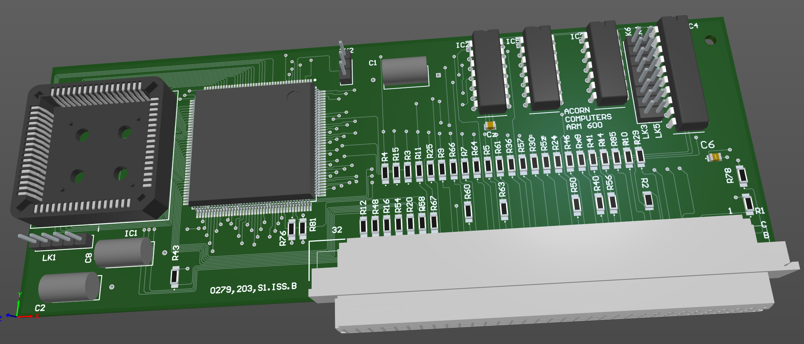

# Acorn A540/R260 Arm600 prototype processor card with FPA

April 2025

This is a reverse-engineering of the only known A540/R260 Arm600 (VY06192) processor card with FPA11.  The card is presently at TNMOC in Bletchley and this work was undertaken purely based on photographs of the card, with (currently) no electronic verification (continuity testing).   Reference material also included the VY86PID2 Arm600 (VY86C600) development board documentation including schematic, and the Acorn A5000 documentation for FPA interfacing.

This project will never be built, as no other VY06192 processors are known to exist.  The project serves purely to document the card design, which was used as a stepping-stone to the Acorn RiscPC platform using the Arm610 and later processors - the Arm6 was never deployed in earlier machines.

[PDF schematic](Generated/Arm600_Prototype_Schematic.pdf)

## Licence

No warranty is provided, and this work is used at your own risk.  

Licenced as CC BY-SA 4.0

Copyright 2025 Ian Jeffray

